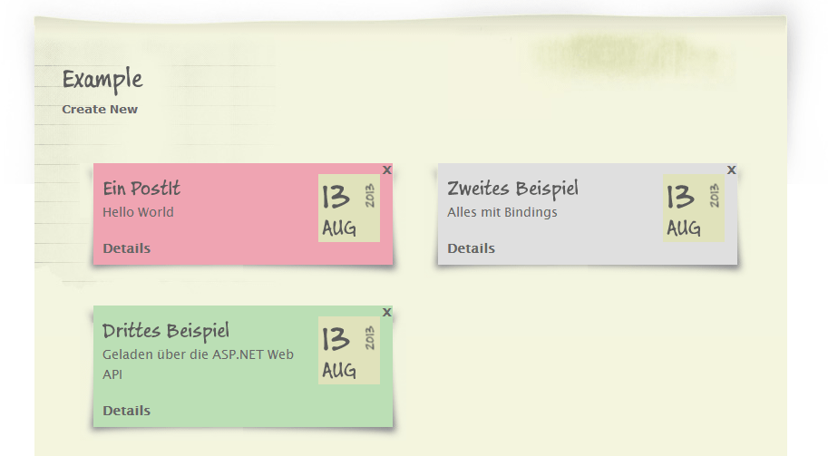

# SPA Workshop - Part 1: NoSQL

##### Table of Contents  
1. Introduction
2. Preparing a simple model
3. Saving the model to MongoDB


## 1. Introduction

Let's review an important part of a modern website: the communication between client and server. It should be lightweight (no SOAP) and standard conform (RESTful). On client-side we will use jQuery and Knockout. The native data format of data in JavaScript is JSON. On the server side we have an ASP.NET MVC 4 / PHP (Zend Framework) website that serves more or less static HTML content. We are free to send our data with AJAX in any format. Why shoudn't we put our data directly in JSON format into our DB?  

 
## 2. Preparing a simple model

For this workshop we will use a very simple model. It is a single C# class / PHP array that represents a sticky post. It can have categories, which are just plain strings for simplicity.  

### C# ###
```csharp
public class Note
{
    public Note()
    {
        Categories = new List<string>();
    }

    public int Id { get; set; }

    public string Title { get; set; }

    public string Message { get; set; }

    public DateTime Added { get; set; }

    public IEnumerable<string> Categories { get; set; }
}
```

### PHP
```php
array(
    "Id" => "5282727b660b934d344ebbcd",
    "Title" => "Testeintrag",
    "Message" => "Ein gruener Postit",
    "Added" => "2012-06-12T22:00:00Z",
    "Categories" => ["hobby", "private"]
)
```

We will use this model to show a editable list of sticky notes:

 

## 3. Saving the model to MongoDB

Saving JSON data to MongoDB is very easy.
The following commands should be executed at the shell and will be ready to use for C# as well as PHP.

```js
use WebNote
db.Notes.drop();

db.Notes.save(
  {
    "Title" : "Testeintrag",
    "Message" : "Ein gruener Postit",
    "Added" : new Date(2012, 05, 13),
    "Categories" : ["hobby", "private"]
  });

db.Notes.save(
  {
    "Title" : "Testeintrag 2",
    "Message" : "Ein roter Postit",
    "Added" : new Date(2012, 05, 14),
    "Categories" : ["important"]  
  });

db.Notes.save(
  {
    "Title" : "Testeintrag 3",
    "Message" : "Ein privater Postit",
    "Added" : new Date(2012, 05, 14),
    "Categories" : ["private"]  
  });
```

The following lines demonstrate the find() command. It will return an iterable cursor to one or more documents. On the command line, a cursor will be immediately iterated and displayed on screen.

```js

db.Notes.find();
db.Notes.find({ Title: /Test/i });
db.Notes.find({ _id: 111 }).limit(1);
```

<hr>
_&copy; 2013, Johannes Hoppe_